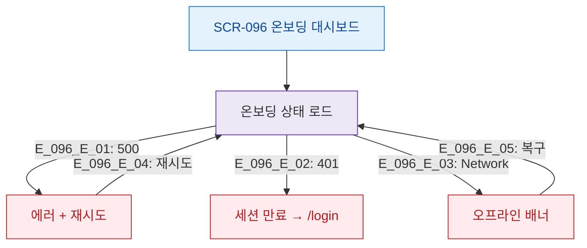

# F8 에러/예외/복구 플로우 — SCR-096 온보딩 대시보드

```mermaid
flowchart TD
  SCR_096[SCR-096 온보딩 대시보드] --> Load[온보딩 상태 로드]

  Load -->|"E_096_E_01: 500"| ErrServer[에러 + 재시도]
  Load -->|"E_096_E_02: 401"| ErrAuth[세션 만료 → /login]
  Load -->|"E_096_E_03: Network"| ErrNet[오프라인 배너]

  ErrServer -->|"E_096_E_04: 재시도"| Load
  ErrNet -->|"E_096_E_05: 복구"| Load

  classDef screen fill:#E3F2FD,stroke:#1976D2,color:#0D47A1
  classDef error fill:#FFEBEE,stroke:#C62828,color:#B71C1C
  classDef system fill:#EDE7F6,stroke:#5E35B2

  class SCR_096 screen
  class ErrServer,ErrAuth,ErrNet error
  class Load system
```

## TC 후보

| TC ID | 타입 | Given | When | Then |
|-------|:----:|-------|------|------|
| TC-096-F8-001 | P1 negative | API 500 | 진입 | 에러 + 재시도 버튼 |
