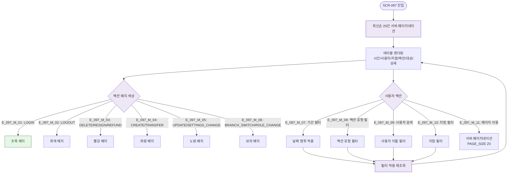

# F2 메인 인터랙션 플로우 — SCR-097 감사 로그

## TC 후보

| TC ID | 타입 | Given | When | Then |
|-------|:----:|-------|------|------|
| TC-097-002 | P1 positive | 로그 목록 | 기간 필터 | 해당 기간 로그만 |
| TC-097-003 | P1 positive | 로그 목록 | "로그인" 필터 | LOGIN만 |
| TC-097-004 | P1 positive | 로그 목록 | "홍길동" 검색 | 해당 사용자만 |
| TC-097-005 | P1 positive | 로그 목록 | "강남점" 필터 | 강남점 로그만 |
| TC-097-006 | P1 positive | 복합 필터 | 기간+액션+사용자 | 교집합 결과 |
| TC-097-007 | P1 positive | 20건 초과 | 2페이지 클릭 | 21~40번째 로그 |
