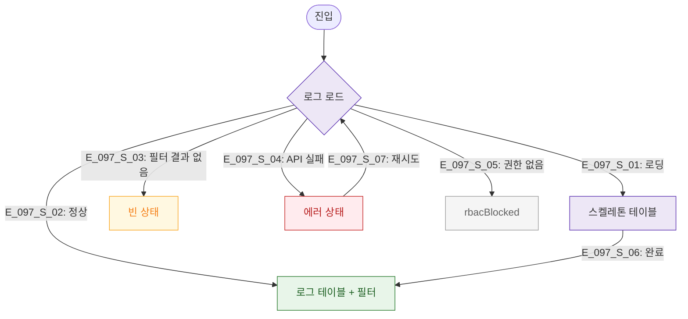

# F6 상태별 화면 플로우 — SCR-097 감사 로그

## TC 후보

| TC ID | 타입 | Given | When | Then |
|-------|:----:|-------|------|------|
| TC-097-F6-001 | P1 positive | 필터 적용 | 결과 없음 | 빈 상태 메시지 |
| TC-097-F6-002 | P0 negative | manager | 진입 | 접근 차단 |
