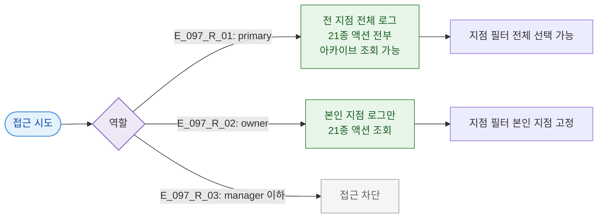

# F7 권한(RBAC) 분기 플로우 — SCR-097 감사 로그

## TC 후보

| TC ID | 타입 | Given | When | Then |
|-------|:----:|-------|------|------|
| TC-097-F7-001 | P0 positive | primary | 지점 필터 | 전 지점 선택 가능 |
| TC-097-F7-002 | P0 negative | manager | 진입 | 접근 차단 |
