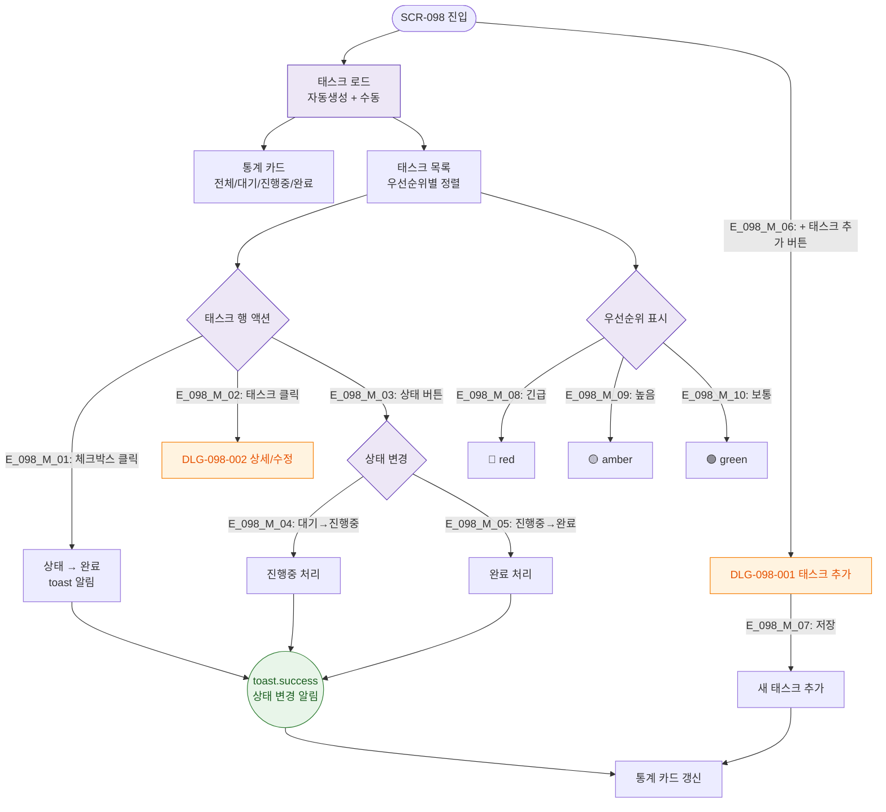

# F2 메인 인터랙션 플로우 — SCR-098 오늘의 할일

## TC 후보

| TC ID | 타입 | Given | When | Then |
|-------|:----:|-------|------|------|
| TC-098-002 | P1 positive | 태스크 목록 | 체크박스 클릭 | 완료 처리 + toast |
| TC-098-003 | P1 positive | + 추가 버튼 | 내용 입력 + 저장 | 목록 추가 |
| TC-098-006 | P1 positive | 전체 27 | 통계 카드 확인 | 4개 카드 수치 표시 |
