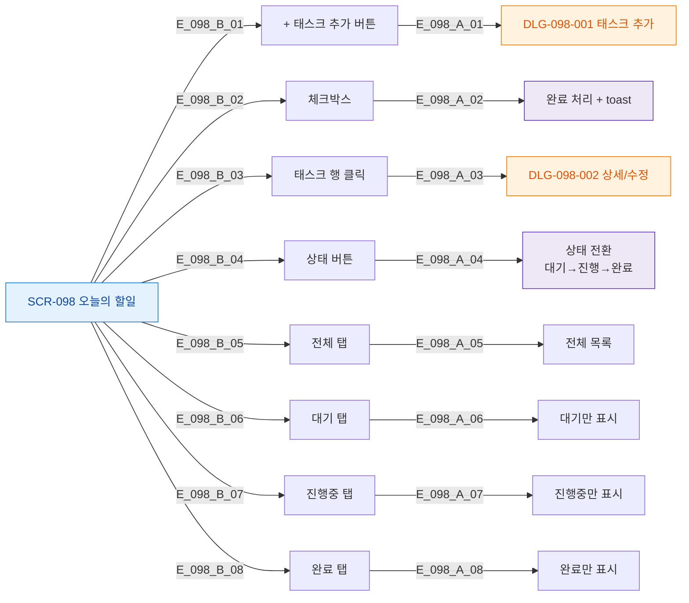

# F3 버튼/액션 매핑 — SCR-098 오늘의 할일

## TC 후보

| TC ID | 타입 | Given | When | Then |
|-------|:----:|-------|------|------|
| TC-098-002 | P1 positive | 태스크 존재 | 체크박스 클릭 | 완료 상태 + toast |
| TC-098-003 | P1 positive | + 추가 버튼 | 입력 + 저장 | 목록 추가 |
