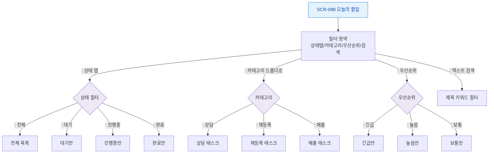

# F4 필터/검색/정렬 플로우 — SCR-098 오늘의 할일

## TC 후보

| TC ID | 타입 | Given | When | Then | |-------|:----:|-------|------|------| | TC-098-004 | P1 positive | 태스크 목록 | "매출" 카테고리 | 매출 태스크만 표시 | | TC-098-005 | P1 positive | 태스크 목록 | "긴급" 우선순위 | 긴급 태스크만 표시 |
