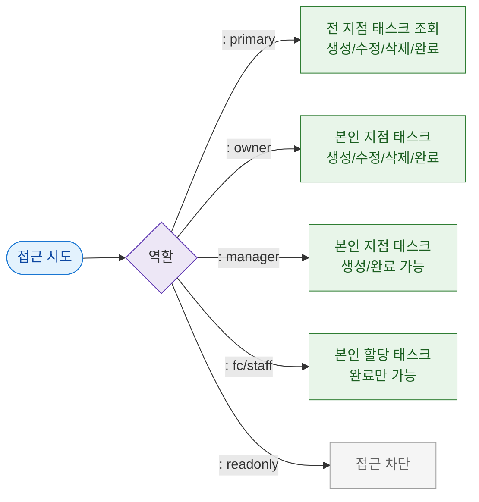

# F7 권한(RBAC) 분기 플로우 — SCR-098 오늘의 할일

```mermaid
flowchart LR
  Entry([접근 시도]) --> Role{역할}

  Role -->|": primary"|PrimaryView[전 지점 태스크 조회\n생성/수정/삭제/완료]
  Role -->|": owner"|OwnerView[본인 지점 태스크\n생성/수정/삭제/완료]
  Role -->|": manager"|ManagerView[본인 지점 태스크\n생성/완료 가능]
  Role -->|": fc/staff"|StaffView[본인 할당 태스크\n완료만 가능]
  Role -->|": readonly"|Blocked[접근 차단]

  classDef screen fill:#E3F2FD,stroke:#1976D2,color:#0D47A1
  classDef system fill:#EDE7F6,stroke:#5E35B2
  classDef success fill:#E8F5E9,stroke:#2E7D32,color:#1B5E20
  classDef rbacBlocked fill:#F5F5F5,stroke:#9E9E9E,color:#616161

  class Entry screen
  class Role system
  class PrimaryView,OwnerView,ManagerView,StaffView success
  class Blocked rbacBlocked
```

## TC 후보

| TC ID | 타입 | Given | When | Then | |-------|:----:|-------|------|------| | TC-098-F7-001 | P1 positive | fc | 태스크 클릭 | 완료 처리만 가능 |
