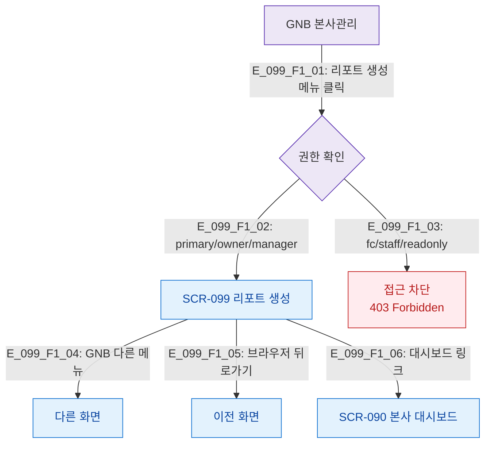

# F1 진입/이탈 플로우 — SCR-099 리포트 생성

```mermaid
flowchart TD
  GNB[GNB 본사관리] -->|"E_099_F1_01: 리포트 생성 메뉴 클릭"| Auth{권한 확인}

  Auth -->|"E_099_F1_02: primary/owner/manager"| SCR_099[SCR-099 리포트 생성]
  Auth -->|"E_099_F1_03: fc/staff/readonly"| Blocked[접근 차단\n403 Forbidden]

  SCR_099 -->|"E_099_F1_04: GNB 다른 메뉴"| OtherSCR[다른 화면]
  SCR_099 -->|"E_099_F1_05: 브라우저 뒤로가기"| PrevSCR[이전 화면]
  SCR_099 -->|"E_099_F1_06: 대시보드 링크"| SCR_090[SCR-090 본사 대시보드]

  classDef screen fill:#E3F2FD,stroke:#1976D2,color:#0D47A1
  classDef system fill:#EDE7F6,stroke:#5E35B2
  classDef error fill:#FFEBEE,stroke:#C62828,color:#B71C1C

  class SCR_099,SCR_090 screen
  class GNB,Auth system
  class Blocked error
  class OtherSCR,PrevSCR screen
```

## TC 후보

| TC ID | 타입 | Given | When | Then |
|-------|:----:|-------|------|------|
| TC-099-001 | P1 positive | manager 로그인 | 리포트 생성 메뉴 클릭 | 리포트 생성 화면 진입 |
