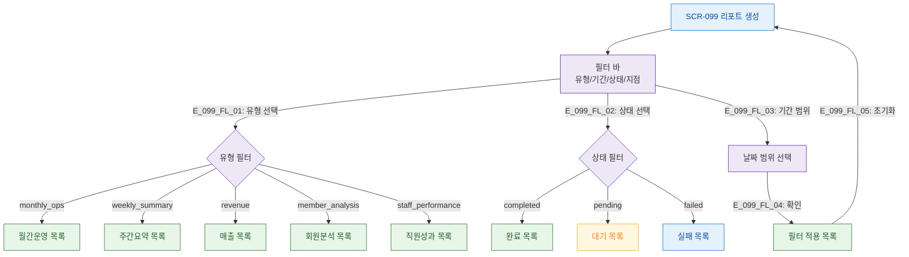

# F4 필터/검색 플로우 — SCR-099 리포트 생성

## TC 후보

| TC ID | 타입 | Given | When | Then |
|-------|:----:|-------|------|------|
| TC-099-004 | P1 positive | 목록 화면 | 유형=월간운영 필터 | 월간운영 리포트만 표시 |
| TC-099-F4-001 | P2 positive | 필터 적용 상태 | 초기화 클릭 | 전체 목록 복귀 |
