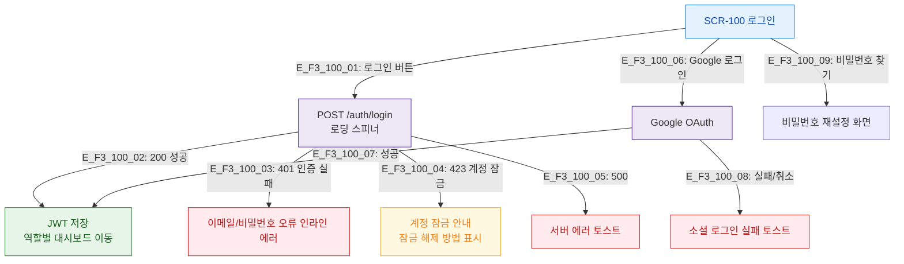

## 다이어그램

```mermaid
flowchart TD
    SCR100[SCR-100 로그인]

    SCR100 -->|"E_F3_100_01: 로그인 버튼"| LoginReq[POST /auth/login\n로딩 스피너]
    LoginReq -->|"E_F3_100_02: 200 성공"| LoginOK[JWT 저장\n역할별 대시보드 이동]
    LoginReq -->|"E_F3_100_03: 401 인증 실패"| E_Auth[이메일/비밀번호 오류 인라인 에러]
    LoginReq -->|"E_F3_100_04: 423 계정 잠금"| E_Locked[계정 잠금 안내\n잠금 해제 방법 표시]
    LoginReq -->|"E_F3_100_05: 500"| E_Server[서버 에러 토스트]

    SCR100 -->|"E_F3_100_06: Google 로그인"| GoogleReq[Google OAuth]
    GoogleReq -->|"E_F3_100_07: 성공"| LoginOK
    GoogleReq -->|"E_F3_100_08: 실패/취소"| E_Social[소셜 로그인 실패 토스트]

    SCR100 -->|"E_F3_100_09: 비밀번호 찾기"| ForgotNav[비밀번호 재설정 화면]

    classDef screen fill:#E3F2FD,stroke:#1976D2,color:#0D47A1
    classDef success fill:#E8F5E9,stroke:#2E7D32,color:#1B5E20
    classDef error fill:#FFEBEE,stroke:#C62828,color:#B71C1C
    classDef warning fill:#FFF8E1,stroke:#F9A825,color:#F57F17
    classDef system fill:#EDE7F6,stroke:#5E35B2
    class SCR100 screen
    class LoginOK success
    class E_Auth,E_Server,E_Social error
    class E_Locked warning
    class LoginReq,GoogleReq system
```

## TC 후보
- TC-100-003: 5회 로그인 실패 → 계정 잠금 안내 표시
