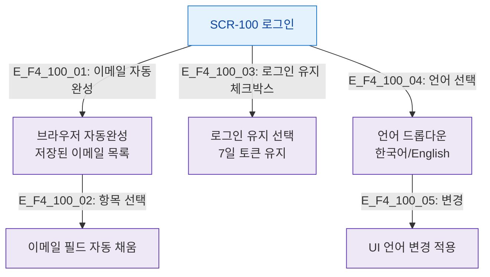

## 다이어그램

```mermaid
flowchart TD
    SCR100[SCR-100 로그인]

    SCR100 -->|"E_F4_100_01: 이메일 자동완성"| AutoComplete[브라우저 자동완성\n저장된 이메일 목록]
    AutoComplete -->|"E_F4_100_02: 항목 선택"| EmailFill[이메일 필드 자동 채움]

    SCR100 -->|"E_F4_100_03: 로그인 유지 체크박스"| RememberMe[로그인 유지 선택\n7일 토큰 유지]

    SCR100 -->|"E_F4_100_04: 언어 선택"| LangSelect[언어 드롭다운\n한국어/English]
    LangSelect -->|"E_F4_100_05: 변경"| LangApply[UI 언어 변경 적용]

    classDef screen fill:#E3F2FD,stroke:#1976D2,color:#0D47A1
    classDef system fill:#EDE7F6,stroke:#5E35B2
    class SCR100 screen
    class AutoComplete,EmailFill,RememberMe,LangSelect,LangApply system
```
