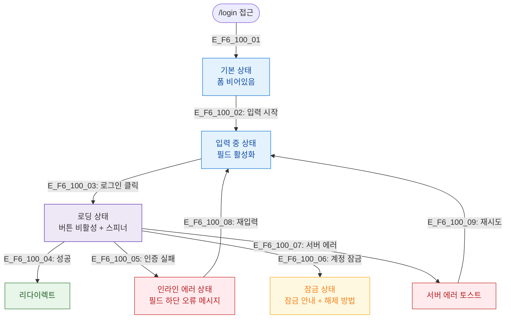

## 다이어그램

```mermaid
flowchart TD
    Entry([/login 접근]) -->|E_F6_100_01| Idle[기본 상태\n폼 비어있음]

    Idle -->|"E_F6_100_02: 입력 시작"| Editing[입력 중 상태\n필드 활성화]
    Editing -->|"E_F6_100_03: 로그인 클릭"| Loading[로딩 상태\n버튼 비활성 + 스피너]
    Loading -->|"E_F6_100_04: 성공"| Redirect[리다이렉트]
    Loading -->|"E_F6_100_05: 인증 실패"| ErrorInline[인라인 에러 상태\n필드 하단 오류 메시지]
    Loading -->|"E_F6_100_06: 계정 잠금"| Locked[잠금 상태\n잠금 안내 + 해제 방법]
    Loading -->|"E_F6_100_07: 서버 에러"| ErrorToast[서버 에러 토스트]

    ErrorInline -->|"E_F6_100_08: 재입력"| Editing
    ErrorToast -->|"E_F6_100_09: 재시도"| Editing

    classDef screen fill:#E3F2FD,stroke:#1976D2,color:#0D47A1
    classDef success fill:#E8F5E9,stroke:#2E7D32,color:#1B5E20
    classDef error fill:#FFEBEE,stroke:#C62828,color:#B71C1C
    classDef warning fill:#FFF8E1,stroke:#F9A825,color:#F57F17
    classDef system fill:#EDE7F6,stroke:#5E35B2
    class Idle,Editing screen
    class Redirect success
    class ErrorInline,ErrorToast error
    class Locked warning
    class Loading system
```
