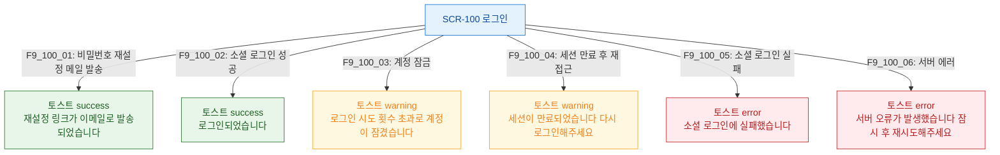

## 다이어그램

## 토스트 메시지 목록
| ID | 트리거 | 타입 | 메시지 |
|----|--------|------|--------|
| F9_100_01 | 비밀번호 재설정 메일 발송 | success | 재설정 링크가 이메일로 발송되었습니다 |
| F9_100_02 | 소셜 로그인 성공 | success | 로그인되었습니다 |
| F9_100_03 | 계정 잠금 | warning | 로그인 시도 횟수 초과로 계정이 잠겼습니다 |
| F9_100_04 | 세션 만료 | warning | 세션이 만료되었습니다. 다시 로그인해주세요 |
| F9_100_05 | 소셜 로그인 실패 | error | 소셜 로그인에 실패했습니다 |
| F9_100_06 | 서버 에러 | error | 서버 오류가 발생했습니다. 잠시 후 재시도해주세요 |
