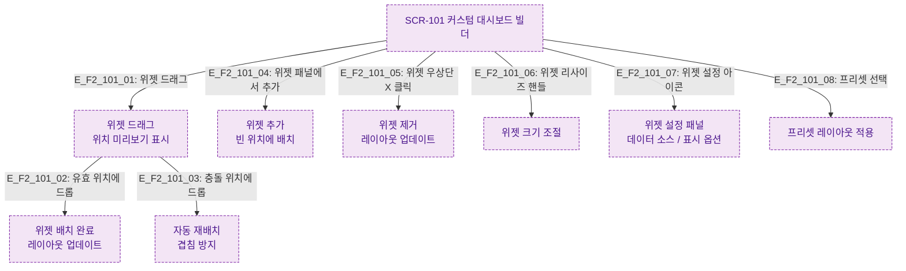

## 다이어그램

```mermaid
flowchart TD
    SCR101[SCR-101 커스텀 대시보드 빌더]

    SCR101 -->|"E_F2_101_01: 위젯 드래그"| DragWidget[위젯 드래그\n위치 미리보기 표시]
    DragWidget -->|"E_F2_101_02: 유효 위치에 드롭"| DropOK[위젯 배치 완료\n레이아웃 업데이트]
    DragWidget -->|"E_F2_101_03: 충돌 위치에 드롭"| AutoReplace[자동 재배치\n겹침 방지]

    SCR101 -->|"E_F2_101_04: 위젯 패널에서 추가"| AddWidget[위젯 추가\n빈 위치에 배치]
    SCR101 -->|"E_F2_101_05: 위젯 우상단 X 클릭"| RemoveWidget[위젯 제거\n레이아웃 업데이트]
    SCR101 -->|"E_F2_101_06: 위젯 리사이즈 핸들"| ResizeWidget[위젯 크기 조절]
    SCR101 -->|"E_F2_101_07: 위젯 설정 아이콘"| WidgetConfig[위젯 설정 패널\n데이터 소스 / 표시 옵션]
    SCR101 -->|"E_F2_101_08: 프리셋 선택"| ApplyPreset[프리셋 레이아웃 적용]

    classDef screen fill:#E3F2FD,stroke:#1976D2,color:#0D47A1
    classDef newFeature fill:#F3E5F5,stroke:#7B1FA2,color:#4A148C,stroke-dasharray:4 2
    classDef system fill:#EDE7F6,stroke:#5E35B2
    class SCR101 newFeature
    class DragWidget,DropOK,AutoReplace,AddWidget,RemoveWidget,ResizeWidget,WidgetConfig,ApplyPreset newFeature
```

## TC 후보
- TC-101-002: 위젯 드래그 앤 드롭 → 새 위치에 배치 완료
