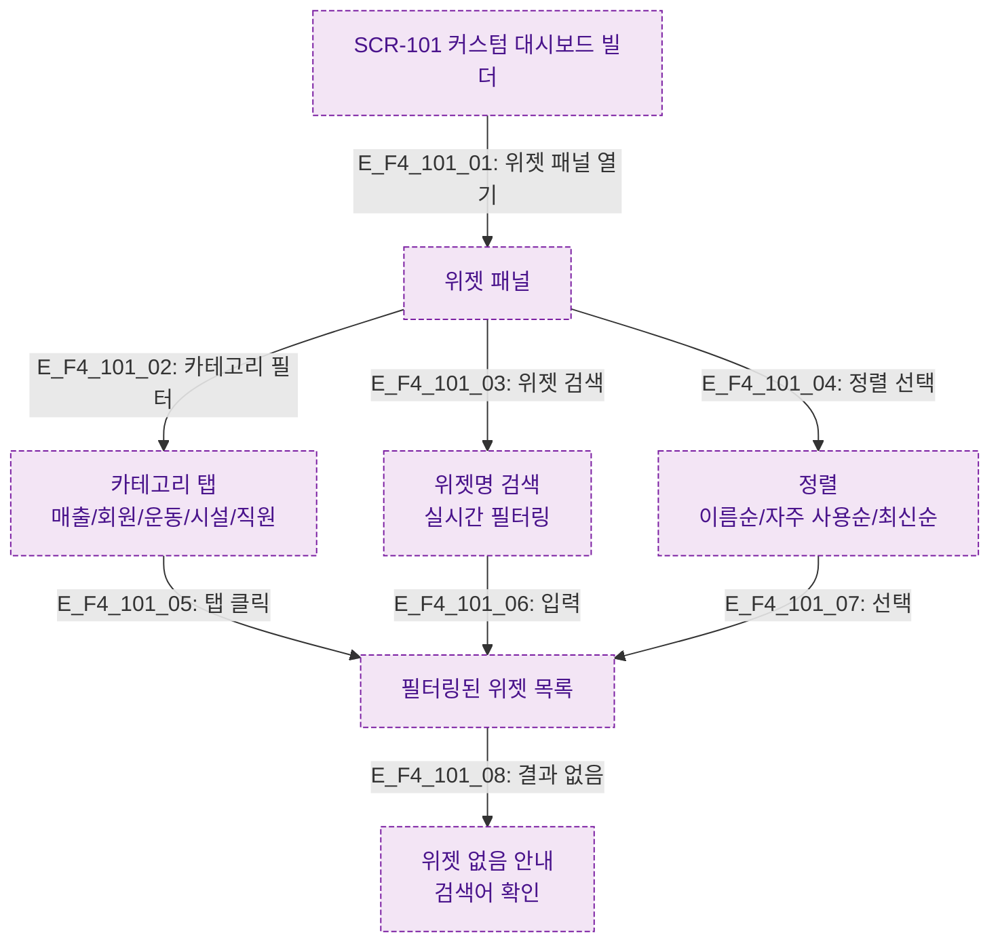

## 다이어그램

```mermaid
flowchart TD
    SCR101[SCR-101 커스텀 대시보드 빌더]

    SCR101 -->|E_F4_101_01: 위젯 패널 열기| WidgetPanel[위젯 패널]
    WidgetPanel -->|E_F4_101_02: 카테고리 필터| CategoryFilter[카테고리 탭\n매출/회원/운동/시설/직원]
    WidgetPanel -->|E_F4_101_03: 위젯 검색| SearchWidget[위젯명 검색\n실시간 필터링]
    WidgetPanel -->|E_F4_101_04: 정렬 선택| SortWidget[정렬\n이름순/자주 사용순/최신순]

    CategoryFilter -->|E_F4_101_05: 탭 클릭| FilteredList[필터링된 위젯 목록]
    SearchWidget -->|E_F4_101_06: 입력| FilteredList
    SortWidget -->|E_F4_101_07: 선택| FilteredList

    FilteredList -->|E_F4_101_08: 결과 없음| EmptyPanel[위젯 없음 안내\n검색어 확인]

    classDef screen fill:#E3F2FD,stroke:#1976D2,color:#0D47A1
    classDef newFeature fill:#F3E5F5,stroke:#7B1FA2,color:#4A148C,stroke-dasharray:4 2
    classDef system fill:#EDE7F6,stroke:#5E35B2
    class SCR101 newFeature
    class WidgetPanel,CategoryFilter,SearchWidget,SortWidget,FilteredList,EmptyPanel newFeature
```
