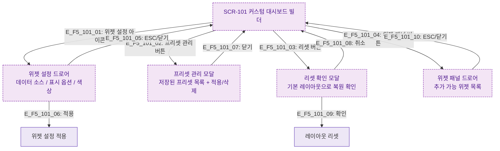

## 다이어그램

```mermaid
flowchart TD
    SCR101[SCR-101 커스텀 대시보드 빌더]

    SCR101 -->|E_F5_101_01: 위젯 설정 아이콘| DrawerConfig[위젯 설정 드로어\n데이터 소스 / 표시 옵션 / 색상]
    SCR101 -->|E_F5_101_02: 프리셋 관리 버튼| ModalPreset[프리셋 관리 모달\n저장된 프리셋 목록 + 적용/삭제]
    SCR101 -->|E_F5_101_03: 리셋 버튼| ModalReset[리셋 확인 모달\n기본 레이아웃으로 복원 확인]
    SCR101 -->|E_F5_101_04: 위젯 패널 버튼| DrawerWidgets[위젯 패널 드로어\n추가 가능 위젯 목록]

    DrawerConfig -->|E_F5_101_05: ESC/닫기| SCR101
    DrawerConfig -->|E_F5_101_06: 적용| ApplyConfig[위젯 설정 적용]
    ModalPreset -->|E_F5_101_07: 닫기| SCR101
    ModalReset -->|E_F5_101_08: 취소| SCR101
    ModalReset -->|E_F5_101_09: 확인| ResetAction[레이아웃 리셋]
    DrawerWidgets -->|E_F5_101_10: ESC/닫기| SCR101

    classDef screen fill:#E3F2FD,stroke:#1976D2,color:#0D47A1
    classDef newFeature fill:#F3E5F5,stroke:#7B1FA2,color:#4A148C,stroke-dasharray:4 2
    classDef system fill:#EDE7F6,stroke:#5E35B2
    class SCR101 newFeature
    class DrawerConfig,ModalPreset,ModalReset,DrawerWidgets newFeature
    class ApplyConfig,ResetAction system
```
