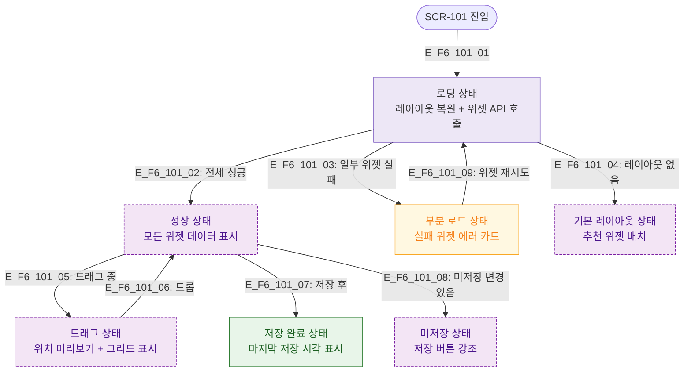

## 다이어그램

```mermaid
flowchart TD
    Entry([SCR-101 진입]) -->|E_F6_101_01| Loading[로딩 상태\n레이아웃 복원 + 위젯 API 호출]
    Loading -->|"E_F6_101_02: 전체 성공"| Populated[정상 상태\n모든 위젯 데이터 표시]
    Loading -->|"E_F6_101_03: 일부 위젯 실패"| Partial[부분 로드 상태\n실패 위젯 에러 카드]
    Loading -->|"E_F6_101_04: 레이아웃 없음"| Default[기본 레이아웃 상태\n추천 위젯 배치]

    Populated -->|"E_F6_101_05: 드래그 중"| Dragging[드래그 상태\n위치 미리보기 + 그리드 표시]
    Dragging -->|"E_F6_101_06: 드롭"| Populated

    Populated -->|"E_F6_101_07: 저장 후"| Saved[저장 완료 상태\n마지막 저장 시각 표시]
    Populated -->|"E_F6_101_08: 미저장 변경 있음"| Unsaved[미저장 상태\n저장 버튼 강조]

    Partial -->|"E_F6_101_09: 위젯 재시도"| Loading

    classDef screen fill:#E3F2FD,stroke:#1976D2,color:#0D47A1
    classDef newFeature fill:#F3E5F5,stroke:#7B1FA2,color:#4A148C,stroke-dasharray:4 2
    classDef warning fill:#FFF8E1,stroke:#F9A825,color:#F57F17
    classDef success fill:#E8F5E9,stroke:#2E7D32,color:#1B5E20
    classDef system fill:#EDE7F6,stroke:#5E35B2
    class Populated,Default,Dragging,Unsaved newFeature
    class Saved success
    class Partial warning
    class Loading system
```
