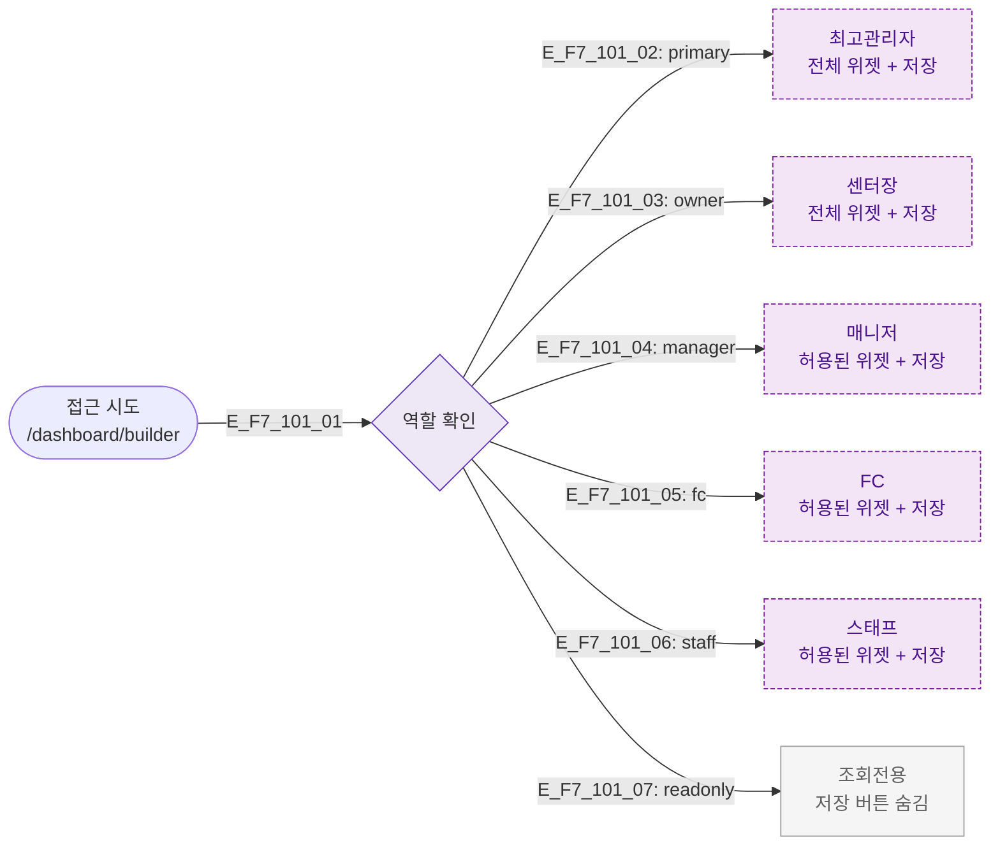

## 다이어그램

## 역할별 접근 매트릭스
| 역할 | 접근 | 위젯 추가 | 레이아웃 저장 | 전체 위젯 접근 |
|------|:---:|:--------:|:-----------:|:------------:|
| primary | ✅ | ✅ | ✅ | ✅ |
| owner | ✅ | ✅ | ✅ | ✅ |
| manager | ✅ | ✅ | ✅ | 일부 |
| fc | ✅ | ✅ | ✅ | 일부 |
| staff | ✅ | ✅ | ✅ | 일부 |
| readonly | ✅ | ❌ | ❌ | ❌ |

## TC 후보
- TC-101-NEG-001: readonly → 저장 버튼 미표시
