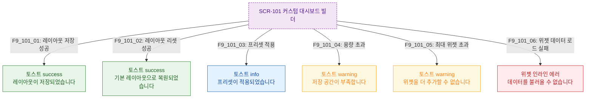

## 다이어그램

## 토스트 메시지 목록
| ID | 트리거 | 타입 | 메시지 | |----|--------|------|--------| | F9_101_01 | 저장 성공 | success | 레이아웃이 저장되었습니다 | | F9_101_02 | 리셋 성공 | success | 기본 레이아웃으로 복원되었습니다 | | F9_101_03 | 프리셋 적용 | info | 프리셋이 적용되었습니다 | | F9_101_04 | 저장 공간 부족 | warning | 저장 공간이 부족합니다 | | F9_101_05 | 최대 위젯 초과 | warning | 위젯을 더 추가할 수 없습니다 | | F9_101_06 | 위젯 데이터 로드 실패 | error(inline) | 데이터를 불러올 수 없습니다 |
