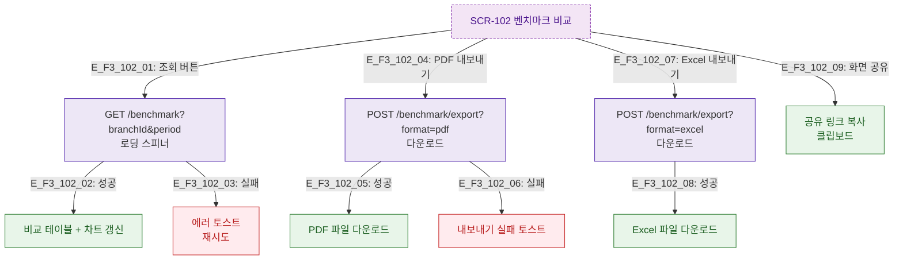

## 다이어그램

```mermaid
flowchart TD
    SCR102[SCR-102 벤치마크 비교]

    SCR102 -->|"E_F3_102_01: 조회 버튼"| Fetch[GET /benchmark?branchId&period\n로딩 스피너]
    Fetch -->|"E_F3_102_02: 성공"| TableRefresh[비교 테이블 + 차트 갱신]
    Fetch -->|"E_F3_102_03: 실패"| FetchErr[에러 토스트\n재시도]

    SCR102 -->|"E_F3_102_04: PDF 내보내기"| ExportPDF[POST /benchmark/export?format=pdf\n다운로드]
    ExportPDF -->|"E_F3_102_05: 성공"| PDFDown[PDF 파일 다운로드]
    ExportPDF -->|"E_F3_102_06: 실패"| ExportErr[내보내기 실패 토스트]

    SCR102 -->|"E_F3_102_07: Excel 내보내기"| ExportXLS[POST /benchmark/export?format=excel\n다운로드]
    ExportXLS -->|"E_F3_102_08: 성공"| XLSDown[Excel 파일 다운로드]

    SCR102 -->|"E_F3_102_09: 화면 공유"| ShareLink[공유 링크 복사\n클립보드]

    classDef screen fill:#E3F2FD,stroke:#1976D2,color:#0D47A1
    classDef newFeature fill:#F3E5F5,stroke:#7B1FA2,color:#4A148C,stroke-dasharray:4 2
    classDef success fill:#E8F5E9,stroke:#2E7D32,color:#1B5E20
    classDef error fill:#FFEBEE,stroke:#C62828,color:#B71C1C
    classDef system fill:#EDE7F6,stroke:#5E35B2
    class SCR102 newFeature
    class TableRefresh,PDFDown,XLSDown,ShareLink success
    class FetchErr,ExportErr error
    class Fetch,ExportPDF,ExportXLS system
```

## TC 후보
- TC-102-003: PDF 내보내기 → 파일 다운로드 성공
