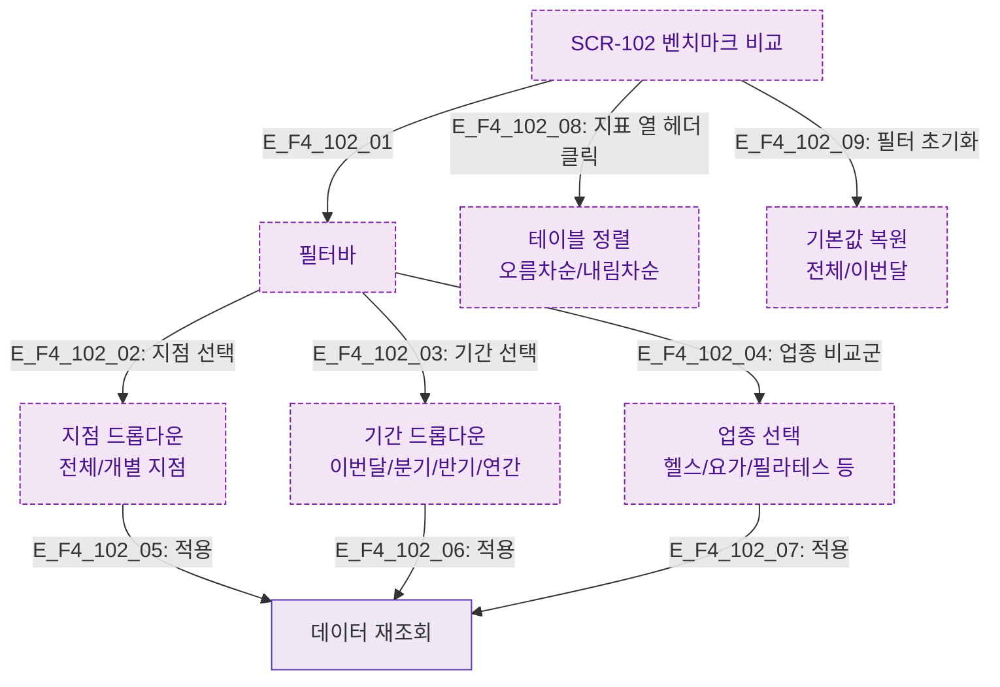

## 다이어그램

```mermaid
flowchart TD
    SCR102[SCR-102 벤치마크 비교]

    SCR102 -->|E_F4_102_01| FilterBar[필터바]
    FilterBar -->|E_F4_102_02: 지점 선택| BranchFilter[지점 드롭다운\n전체/개별 지점]
    FilterBar -->|E_F4_102_03: 기간 선택| PeriodFilter[기간 드롭다운\n이번달/분기/반기/연간]
    FilterBar -->|E_F4_102_04: 업종 비교군| IndustryFilter[업종 선택\n헬스/요가/필라테스 등]

    BranchFilter -->|E_F4_102_05: 적용| Reload[데이터 재조회]
    PeriodFilter -->|E_F4_102_06: 적용| Reload
    IndustryFilter -->|E_F4_102_07: 적용| Reload

    SCR102 -->|E_F4_102_08: 지표 열 헤더 클릭| SortTable[테이블 정렬\n오름차순/내림차순]
    SCR102 -->|E_F4_102_09: 필터 초기화| ResetFilter[기본값 복원\n전체/이번달]

    classDef screen fill:#E3F2FD,stroke:#1976D2,color:#0D47A1
    classDef newFeature fill:#F3E5F5,stroke:#7B1FA2,color:#4A148C,stroke-dasharray:4 2
    classDef system fill:#EDE7F6,stroke:#5E35B2
    class SCR102 newFeature
    class FilterBar,BranchFilter,PeriodFilter,IndustryFilter,SortTable,ResetFilter newFeature
    class Reload system
```
