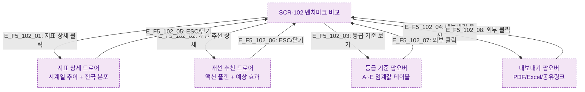

## 다이어그램

```mermaid
flowchart TD
    SCR102[SCR-102 벤치마크 비교]

    SCR102 -->|E_F5_102_01: 지표 상세 클릭| DrawerMetric[지표 상세 드로어\n시계열 추이 + 전국 분포]
    SCR102 -->|E_F5_102_02: 개선 추천 상세| DrawerSuggest[개선 추천 드로어\n액션 플랜 + 예상 효과]
    SCR102 -->|E_F5_102_03: 등급 기준 보기| PopoverGrade[등급 기준 팝오버\nA~E 임계값 테이블]
    SCR102 -->|E_F5_102_04: 내보내기 옵션| PopoverExport[내보내기 팝오버\nPDF/Excel/공유링크]

    DrawerMetric -->|E_F5_102_05: ESC/닫기| SCR102
    DrawerSuggest -->|E_F5_102_06: ESC/닫기| SCR102
    PopoverGrade -->|E_F5_102_07: 외부 클릭| SCR102
    PopoverExport -->|E_F5_102_08: 외부 클릭| SCR102

    classDef screen fill:#E3F2FD,stroke:#1976D2,color:#0D47A1
    classDef newFeature fill:#F3E5F5,stroke:#7B1FA2,color:#4A148C,stroke-dasharray:4 2
    class SCR102 newFeature
    class DrawerMetric,DrawerSuggest,PopoverGrade,PopoverExport newFeature
```
