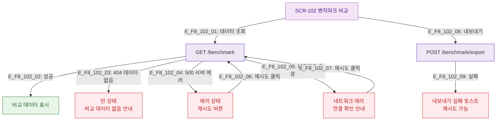

## 다이어그램

```mermaid
flowchart TD
    SCR102[SCR-102 벤치마크 비교]

    SCR102 -->|"E_F8_102_01: 데이터 조회"| DataReq[GET /benchmark]
    DataReq -->|"E_F8_102_02: 성공"| DataOK[비교 데이터 표시]
    DataReq -->|"E_F8_102_03: 404 데이터 없음"| E_Empty[빈 상태\n비교 데이터 없음 안내]
    DataReq -->|"E_F8_102_04: 500 서버 에러"| E_Server[에러 상태\n재시도 버튼]
    DataReq -->|"E_F8_102_05: 네트워크 오류"| E_Network[네트워크 에러\n연결 확인 안내]

    E_Server -->|"E_F8_102_06: 재시도 클릭"| DataReq
    E_Network -->|"E_F8_102_07: 재시도 클릭"| DataReq

    SCR102 -->|"E_F8_102_08: 내보내기"| ExportReq[POST /benchmark/export]
    ExportReq -->|"E_F8_102_09: 실패"| E_Export[내보내기 실패 토스트\n재시도 가능]

    classDef screen fill:#E3F2FD,stroke:#1976D2,color:#0D47A1
    classDef newFeature fill:#F3E5F5,stroke:#7B1FA2,color:#4A148C,stroke-dasharray:4 2
    classDef success fill:#E8F5E9,stroke:#2E7D32,color:#1B5E20
    classDef error fill:#FFEBEE,stroke:#C62828,color:#B71C1C
    classDef system fill:#EDE7F6,stroke:#5E35B2
    class SCR102 newFeature
    class DataOK success
    class E_Empty,E_Server,E_Network,E_Export error
    class DataReq,ExportReq system
```

## TC 후보
- TC-102-NEG-002: 서버 에러 → 에러 상태 표시 + 재시도 클릭 → 재조회
