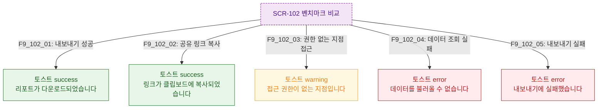

## 다이어그램

## 토스트 메시지 목록
| ID | 트리거 | 타입 | 메시지 |
|----|--------|------|--------|
| F9_102_01 | 내보내기 성공 | success | 리포트가 다운로드되었습니다 |
| F9_102_02 | 링크 복사 | success | 링크가 클립보드에 복사되었습니다 |
| F9_102_03 | 권한 없는 지점 | warning | 접근 권한이 없는 지점입니다 |
| F9_102_04 | 조회 실패 | error | 데이터를 불러올 수 없습니다 |
| F9_102_05 | 내보내기 실패 | error | 내보내기에 실패했습니다 |
