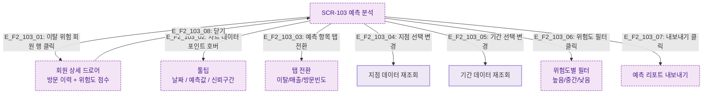

## 다이어그램

```mermaid
flowchart TD
    SCR103[SCR-103 예측 분석]

    SCR103 -->|E_F2_103_01: 이탈 위험 회원 행 클릭| MemberDetail[회원 상세 드로어\n방문 이력 + 위험도 점수]
    SCR103 -->|E_F2_103_02: 차트 데이터 포인트 호버| Tooltip[툴팁\n날짜 / 예측값 / 신뢰구간]
    SCR103 -->|E_F2_103_03: 예측 항목 탭 전환| TabSwitch[탭 전환\n이탈/매출/방문빈도]
    SCR103 -->|E_F2_103_04: 지점 선택 변경| BranchSwitch[지점 데이터 재조회]
    SCR103 -->|E_F2_103_05: 기간 선택 변경| PeriodSwitch[기간 데이터 재조회]
    SCR103 -->|E_F2_103_06: 위험도 필터 클릭| RiskFilter[위험도별 필터\n높음/중간/낮음]
    SCR103 -->|E_F2_103_07: 내보내기 클릭| Export[예측 리포트 내보내기]

    MemberDetail -->|E_F2_103_08: 닫기| SCR103

    classDef screen fill:#E3F2FD,stroke:#1976D2,color:#0D47A1
    classDef newFeature fill:#F3E5F5,stroke:#7B1FA2,color:#4A148C,stroke-dasharray:4 2
    classDef system fill:#EDE7F6,stroke:#5E35B2
    class SCR103 newFeature
    class MemberDetail,Tooltip,TabSwitch,RiskFilter,Export newFeature
    class BranchSwitch,PeriodSwitch system
```

## TC 후보
- TC-103-002: 이탈 위험 회원 행 클릭 → 회원 상세 드로어 표시
