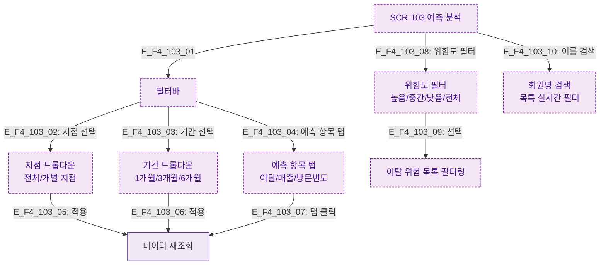

## 다이어그램

```mermaid
flowchart TD
    SCR103[SCR-103 예측 분석]

    SCR103 -->|E_F4_103_01| FilterBar[필터바]
    FilterBar -->|"E_F4_103_02: 지점 선택"| BranchFilter[지점 드롭다운\n전체/개별 지점]
    FilterBar -->|"E_F4_103_03: 기간 선택"| PeriodFilter[기간 드롭다운\n1개월/3개월/6개월]
    FilterBar -->|"E_F4_103_04: 예측 항목 탭"| ItemFilter[예측 항목 탭\n이탈/매출/방문빈도]

    BranchFilter -->|"E_F4_103_05: 적용"| Reload[데이터 재조회]
    PeriodFilter -->|"E_F4_103_06: 적용"| Reload
    ItemFilter -->|"E_F4_103_07: 탭 클릭"| Reload

    SCR103 -->|"E_F4_103_08: 위험도 필터"| RiskFilter[위험도 필터\n높음/중간/낮음/전체]
    RiskFilter -->|"E_F4_103_09: 선택"| ListFilter[이탈 위험 목록 필터링]

    SCR103 -->|"E_F4_103_10: 이름 검색"| SearchMember[회원명 검색\n목록 실시간 필터]

    classDef screen fill:#E3F2FD,stroke:#1976D2,color:#0D47A1
    classDef newFeature fill:#F3E5F5,stroke:#7B1FA2,color:#4A148C,stroke-dasharray:4 2
    classDef system fill:#EDE7F6,stroke:#5E35B2
    class SCR103 newFeature
    class FilterBar,BranchFilter,PeriodFilter,ItemFilter,RiskFilter,ListFilter,SearchMember newFeature
    class Reload system
```
