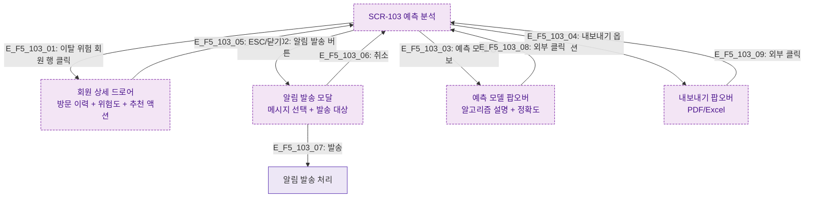

## 다이어그램

```mermaid
flowchart TD
    SCR103[SCR-103 예측 분석]

    SCR103 -->|"E_F5_103_01: 이탈 위험 회원 행 클릭"| DrawerMember[회원 상세 드로어\n방문 이력 + 위험도 + 추천 액션]
    SCR103 -->|"E_F5_103_02: 알림 발송 버튼"| ModalNotify[알림 발송 모달\n메시지 선택 + 발송 대상]
    SCR103 -->|"E_F5_103_03: 예측 모델 정보"| PopoverModel[예측 모델 팝오버\n알고리즘 설명 + 정확도]
    SCR103 -->|"E_F5_103_04: 내보내기 옵션"| PopoverExport[내보내기 팝오버\nPDF/Excel]

    DrawerMember -->|"E_F5_103_05: ESC/닫기"| SCR103
    ModalNotify -->|"E_F5_103_06: 취소"| SCR103
    ModalNotify -->|"E_F5_103_07: 발송"| NotifyAction[알림 발송 처리]
    PopoverModel -->|"E_F5_103_08: 외부 클릭"| SCR103
    PopoverExport -->|"E_F5_103_09: 외부 클릭"| SCR103

    classDef screen fill:#E3F2FD,stroke:#1976D2,color:#0D47A1
    classDef newFeature fill:#F3E5F5,stroke:#7B1FA2,color:#4A148C,stroke-dasharray:4 2
    classDef system fill:#EDE7F6,stroke:#5E35B2
    class SCR103 newFeature
    class DrawerMember,ModalNotify,PopoverModel,PopoverExport newFeature
    class NotifyAction system
```
