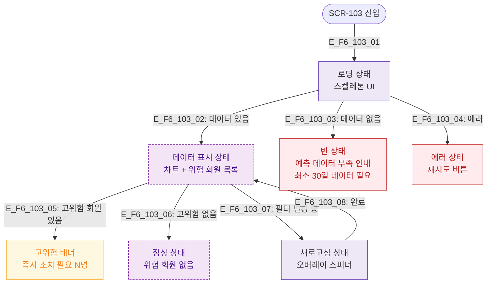

## 다이어그램

```mermaid
flowchart TD
    Entry([SCR-103 진입]) -->|E_F6_103_01| Loading[로딩 상태\n스켈레톤 UI]
    Loading -->|E_F6_103_02: 데이터 있음| Populated[데이터 표시 상태\n차트 + 위험 회원 목록]
    Loading -->|E_F6_103_03: 데이터 없음| Empty[빈 상태\n예측 데이터 부족 안내\n최소 30일 데이터 필요]
    Loading -->|E_F6_103_04: 에러| ErrorState[에러 상태\n재시도 버튼]

    Populated -->|E_F6_103_05: 고위험 회원 있음| HighRisk[고위험 배너\n즉시 조치 필요 N명]
    Populated -->|E_F6_103_06: 고위험 없음| Normal[정상 상태\n위험 회원 없음]

    Populated -->|E_F6_103_07: 필터 변경 중| Refreshing[새로고침 상태\n오버레이 스피너]
    Refreshing -->|E_F6_103_08: 완료| Populated

    classDef screen fill:#E3F2FD,stroke:#1976D2,color:#0D47A1
    classDef newFeature fill:#F3E5F5,stroke:#7B1FA2,color:#4A148C,stroke-dasharray:4 2
    classDef error fill:#FFEBEE,stroke:#C62828,color:#B71C1C
    classDef warning fill:#FFF8E1,stroke:#F9A825,color:#F57F17
    classDef system fill:#EDE7F6,stroke:#5E35B2
    class Populated,Normal newFeature
    class HighRisk warning
    class ErrorState,Empty error
    class Loading,Refreshing system
```
