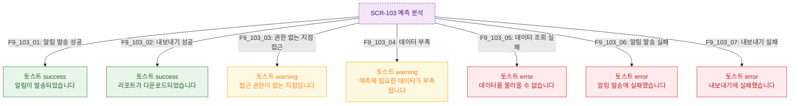

## 다이어그램

## 토스트 메시지 목록
| ID | 트리거 | 타입 | 메시지 | |----|--------|------|--------| | F9_103_01 | 알림 발송 성공 | success | 알림이 발송되었습니다 | | F9_103_02 | 내보내기 성공 | success | 리포트가 다운로드되었습니다 | | F9_103_03 | 권한 없는 지점 | warning | 접근 권한이 없는 지점입니다 | | F9_103_04 | 데이터 부족 | warning | 예측에 필요한 데이터가 부족합니다 | | F9_103_05 | 조회 실패 | error | 데이터를 불러올 수 없습니다 | | F9_103_06 | 알림 발송 실패 | error | 알림 발송에 실패했습니다 | | F9_103_07 | 내보내기 실패 | error | 내보내기에 실패했습니다 |
