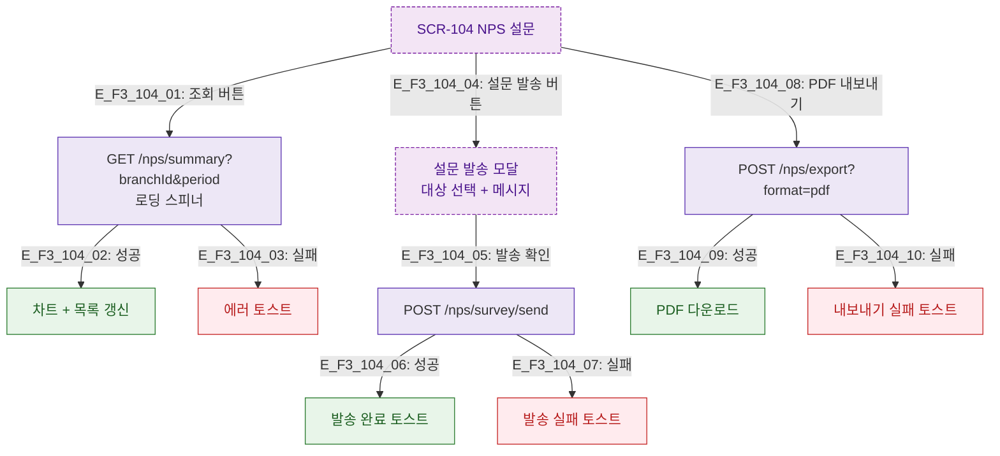

## 다이어그램

```mermaid
flowchart TD
    SCR104[SCR-104 NPS 설문]

    SCR104 -->|"E_F3_104_01: 조회 버튼"| Fetch[GET /nps/summary?branchId&period\n로딩 스피너]
    Fetch -->|"E_F3_104_02: 성공"| Refresh[차트 + 목록 갱신]
    Fetch -->|"E_F3_104_03: 실패"| FetchErr[에러 토스트]

    SCR104 -->|"E_F3_104_04: 설문 발송 버튼"| ModalSend[설문 발송 모달\n대상 선택 + 메시지]
    ModalSend -->|"E_F3_104_05: 발송 확인"| SendReq[POST /nps/survey/send]
    SendReq -->|"E_F3_104_06: 성공"| SendOK[발송 완료 토스트]
    SendReq -->|"E_F3_104_07: 실패"| SendErr[발송 실패 토스트]

    SCR104 -->|"E_F3_104_08: PDF 내보내기"| ExportPDF[POST /nps/export?format=pdf]
    ExportPDF -->|"E_F3_104_09: 성공"| PDFDown[PDF 다운로드]
    ExportPDF -->|"E_F3_104_10: 실패"| ExportErr[내보내기 실패 토스트]

    classDef screen fill:#E3F2FD,stroke:#1976D2,color:#0D47A1
    classDef newFeature fill:#F3E5F5,stroke:#7B1FA2,color:#4A148C,stroke-dasharray:4 2
    classDef success fill:#E8F5E9,stroke:#2E7D32,color:#1B5E20
    classDef error fill:#FFEBEE,stroke:#C62828,color:#B71C1C
    classDef system fill:#EDE7F6,stroke:#5E35B2
    class SCR104 newFeature
    class ModalSend newFeature
    class Refresh,SendOK,PDFDown success
    class FetchErr,SendErr,ExportErr error
    class Fetch,SendReq,ExportPDF system
```

## TC 후보
- TC-104-003: 설문 발송 → 대상 선택 → 발송 완료 토스트
