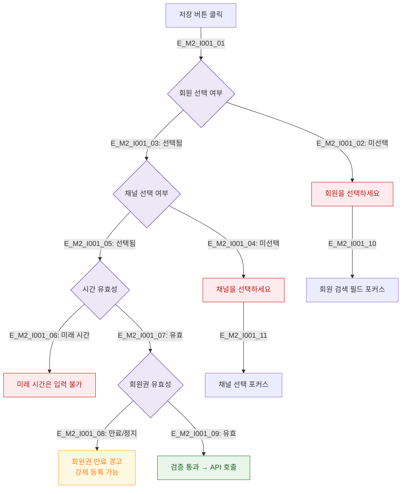

# M2 필드 검증 플로우 — DLG-I001 수동 출석 등록

## 다이어그램

## TC 후보
| TC ID | 타입 | Given | When | Then |
|-------|------|-------|------|------|
| TC-DLG-I001-M2-01 | negative | staff | 회원 미선택 | 회원 선택 에러, 포커스 이동 |
| TC-DLG-I001-M2-02 | negative | staff | 미래 시간 입력 | 시간 유효성 에러 |
| TC-DLG-I001-M2-03 | negative | staff | 만료 회원 수동 등록 | 경고 표시, 강제 등록 선택 가능 |
