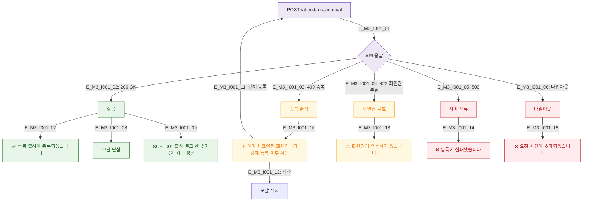

# M3 성공/실패 결과 분기 — DLG-I001 수동 출석 등록

## 다이어그램

## TC 후보
| TC ID | 타입 | Given | When | Then |
|-------|------|-------|------|------|
| TC-DLG-I001-M3-01 | positive | staff | 정상 등록 | 성공 토스트, 모달 닫힘, 로그 추가 |
| TC-DLG-I001-M3-02 | negative | staff | 중복 체크인 | 경고 표시, 강제 등록 선택 |
| TC-DLG-I001-M3-03 | negative | staff | 서버 500 | 에러 토스트, 모달 유지 |
