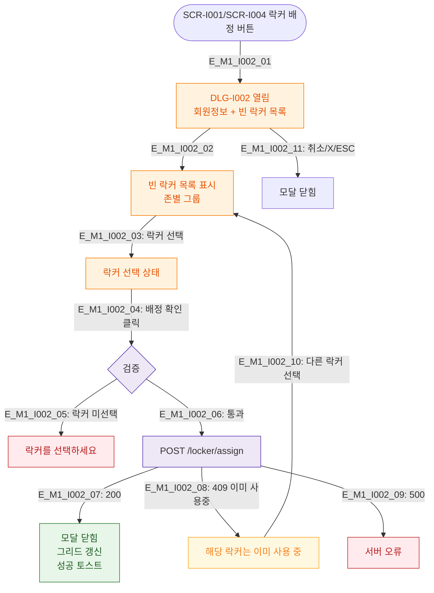

# M1 모달 생명주기 — DLG-I002 옷 락커 배정

## 다이어그램

## TC 후보
| TC ID | 타입 | Given | When | Then |
|-------|------|-------|------|------|
| TC-DLG-I002-M1-01 | positive | staff | 빈 락커 선택 → 배정 | 배정 완료, 모달 닫힘 |
| TC-DLG-I002-M1-02 | negative | staff | 락커 미선택 배정 | 락커 선택 에러 |
| TC-DLG-I002-M1-03 | negative | staff | 이미 사용중인 락커 선택 | 409 충돌 경고 |
