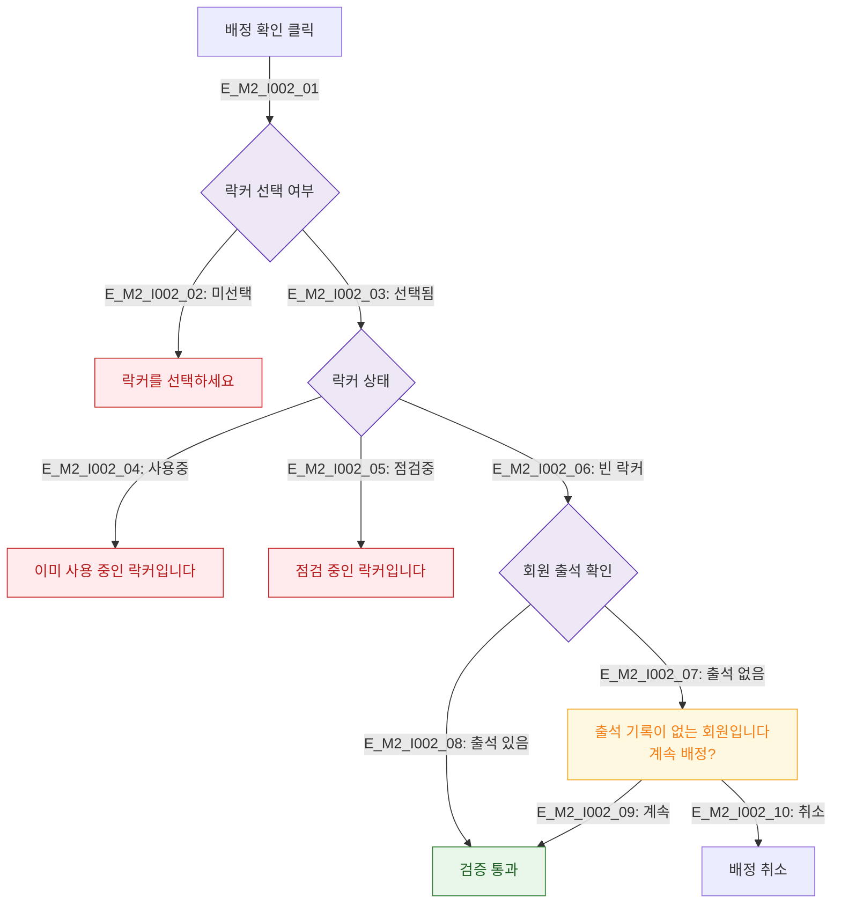

# M2 필드 검증 플로우 — DLG-I002 옷 락커 배정

## 다이어그램

## TC 후보
| TC ID | 타입 | Given | When | Then |
|-------|------|-------|------|------|
| TC-DLG-I002-M2-01 | negative | staff | 락커 미선택 배정 | 선택 에러 |
| TC-DLG-I002-M2-02 | negative | staff | 점검중 락커 선택 | 점검중 에러 |
| TC-DLG-I002-M2-03 | negative | staff | 출석 없는 회원 배정 | 경고 표시, 계속 선택 가능 |
