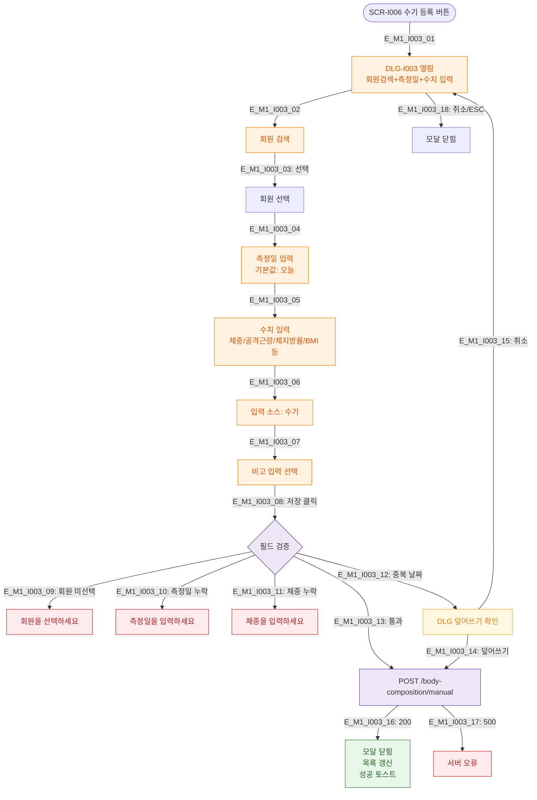

# M1 모달 생명주기 — DLG-I003 체성분 수기 등록

## 다이어그램

## TC 후보
| TC ID | 타입 | Given | When | Then |
|-------|------|-------|------|------|
| TC-DLG-I003-M1-01 | positive | fc | 회원+날짜+수치 입력 후 저장 | 등록 완료, 모달 닫힘 |
| TC-DLG-I003-M1-02 | negative | fc | 체중 미입력 저장 | 체중 에러 |
| TC-DLG-I003-M1-03 | negative | fc | 동일 날짜 중복 | 덮어쓰기 확인 모달 |
