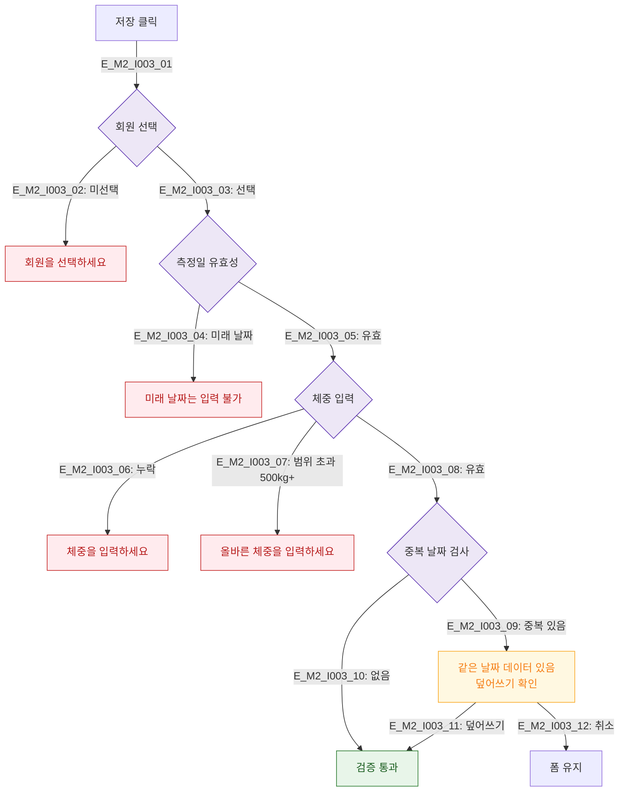

# M2 필드 검증 플로우 — DLG-I003 체성분 수기 등록

## 다이어그램

## TC 후보
| TC ID | 타입 | Given | When | Then |
|-------|------|-------|------|------|
| TC-DLG-I003-M2-01 | negative | fc | 미래 날짜 | 미래 날짜 에러 |
| TC-DLG-I003-M2-02 | negative | fc | 체중 500kg 초과 | 범위 에러 |
| TC-DLG-I003-M2-03 | negative | fc | 동일 날짜 기존 데이터 | 덮어쓰기 경고 |
