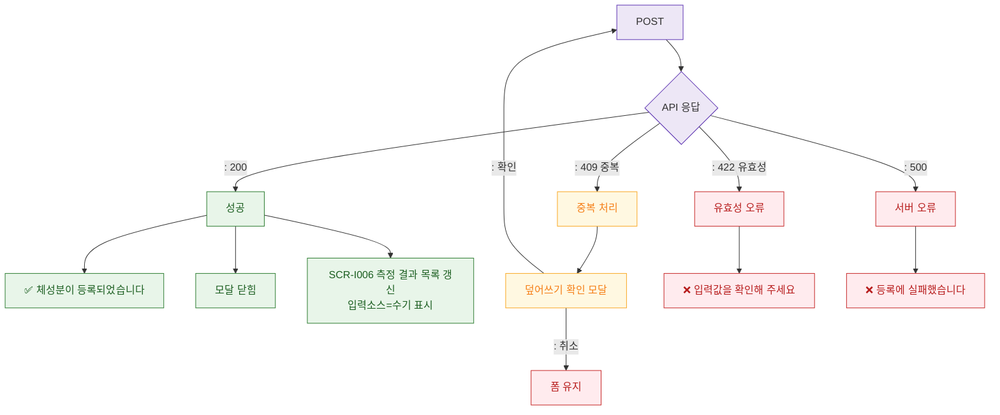

# M3 성공/실패 결과 분기 — DLG-I003 체성분 수기 등록

## 다이어그램

## TC 후보
| TC ID | 타입 | Given | When | Then | |-------|------|-------|------|------| | TC-DLG-I003-M3-01 | positive | fc | 정상 등록 | 성공 토스트, 모달 닫힘, 목록 갱신 | | TC-DLG-I003-M3-02 | negative | fc | 409 중복 날짜 | 덮어쓰기 확인 모달 | | TC-DLG-I003-M3-03 | negative | fc | 서버 500 | 에러 토스트, 폼 유지 |
