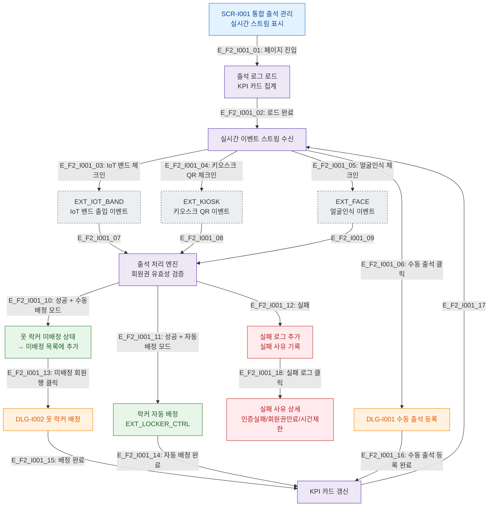

# F2 메인 인터랙션 플로우 — SCR-I001 통합 출석 관리

## 목적
통합 출석 관리 화면의 정상 시나리오(Happy Path)를 정의한다. IoT 채널별 출석 이벤트 수신, 옷 락커 배정, 수동 출석 등록 흐름을 포함한다.

## 전제조건
- 로그인 세션 유효, 출석 관리 권한 보유
- 실시간 스트림 WebSocket 연결 상태

## 다이어그램

## 엣지 설명

| 엣지 ID | 출발 | 도착 | 설명 |
|---------|------|------|------|
| E_F2_I001_03 | STREAM | EVT_IOT | IoT 밴드 출입 이벤트 수신 (X14 시퀀스 참조) |
| E_F2_I001_04 | STREAM | EVT_KIOSK | 키오스크 QR 이벤트 수신 (X23 시퀀스 참조) |
| E_F2_I001_10 | PROC | LOCKER_MANUAL | 성공 + 수동배정 모드 → 미배정 목록 추가 |
| E_F2_I001_11 | PROC | LOCKER_AUTO | 성공 + 자동배정 모드 → 락커 컨트롤러 자동 배정 |
| E_F2_I001_12 | PROC | FAIL_LOG | 인증 실패/회원권 만료/시간 제한 |

## TC 후보

| TC ID | 타입 | Given | When | Then |
|-------|------|-------|------|------|
| TC-I001-F2-01 | positive | manager, 유효 회원권 | IoT 밴드 체크인 | 출석 성공, 미배정 목록 추가 |
| TC-I001-F2-02 | positive | manager, 자동배정 설정 | 키오스크 QR 체크인 | 출석 성공, 락커 자동 배정 |
| TC-I001-F2-03 | negative | manager | 만료 회원 체크인 시도 | 실패 로그 추가, 실패 사유 표시 |
| TC-I001-F2-04 | positive | staff | 수동 출석 등록 버튼 클릭 | DLG-I001 모달 열림 |
