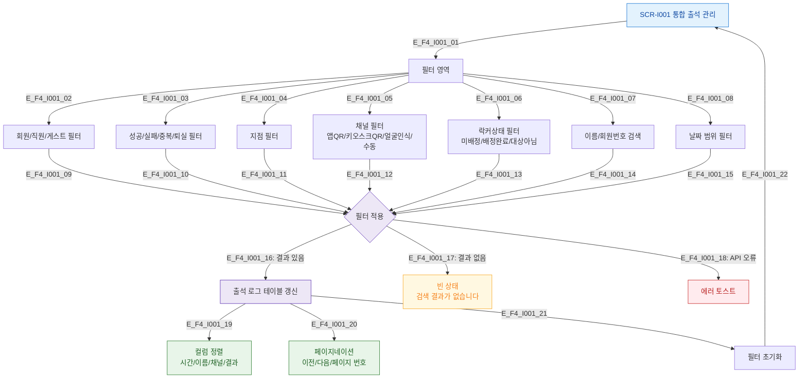

# F4 필터/검색/정렬 플로우 — SCR-I001 통합 출석 관리

## 목적
필터 조합, 검색, 정렬, 페이지네이션 동작을 정의한다.

## 다이어그램

## TC 후보

| TC ID | 타입 | Given | When | Then |
|-------|------|-------|------|------|
| TC-I001-F4-01 | positive | manager | 회원 타입 + 실패 결과 필터 조합 | 해당 조건 출석 로그만 표시 |
| TC-I001-F4-02 | positive | manager | 이름 검색 | 검색어 포함 회원 출석만 표시 |
| TC-I001-F4-03 | positive | manager | 채널 = 키오스크QR | 키오스크 체크인만 필터 |
| TC-I001-F4-04 | positive | manager | 락커상태 = 미배정 | 미배정 회원만 표시 |
| TC-I001-F4-05 | positive | manager | 필터 초기화 클릭 | 전체 출석 로그 복원 |
