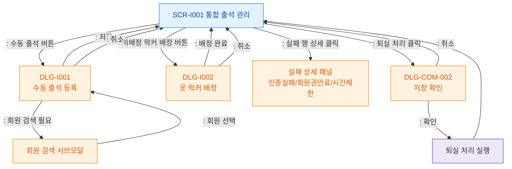

# F5 모달 트리거 트리 — SCR-I001 통합 출석 관리

## 목적
SCR-I001에서 발생하는 모든 모달/다이얼로그 트리거 경로를 정의한다.

## 다이어그램

## TC 후보

| TC ID | 타입 | Given | When | Then | |-------|------|-------|------|------| | TC-I001-F5-01 | positive | staff | 수동 출석 버튼 클릭 | DLG-I001 열림 | | TC-I001-F5-02 | positive | staff | 미배정 회원 락커 배정 버튼 클릭 | DLG-I002 열림 | | TC-I001-F5-03 | positive | manager | 실패 행 클릭 | 실패 상세 패널 열림 | | TC-I001-F5-04 | positive | manager | 퇴실 처리 클릭 | DLG-COM-002 확인 모달 열림 | | TC-I001-F5-05 | positive | staff | DLG-I001 > 회원 검색 | 회원 검색 서브모달 열림 |
