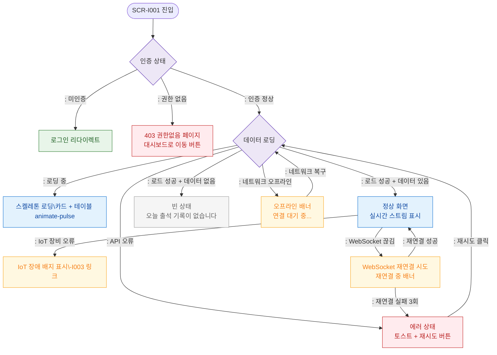

# F6 상태별 화면 플로우 — SCR-I001 통합 출석 관리

## 목적
로딩/빈/에러/권한없음/오프라인/IoT장애 등 UI 상태별 분기를 정의한다.

## 다이어그램

## TC 후보

| TC ID | 타입 | Given | When | Then | |-------|------|-------|------|------| | TC-I001-F6-01 | positive | manager | 페이지 진입 중 | 스켈레톤 로딩 표시 | | TC-I001-F6-02 | positive | manager, 오늘 출석 없음 | 페이지 로드 완료 | 빈 상태 메시지 표시 | | TC-I001-F6-03 | negative | manager | API 서버 오류 | 에러 토스트 + 재시도 버튼 | | TC-I001-F6-04 | negative | staff | 네트워크 오프라인 | 오프라인 배너 표시 | | TC-I001-F6-05 | negative | manager | WebSocket 연결 끊김 | 재연결 시도 배너 표시 | | TC-I001-F6-06 | negative | manager | IoT 장비 오류 상태 | 장애 배지 표시 + SCR-I003 링크 |
