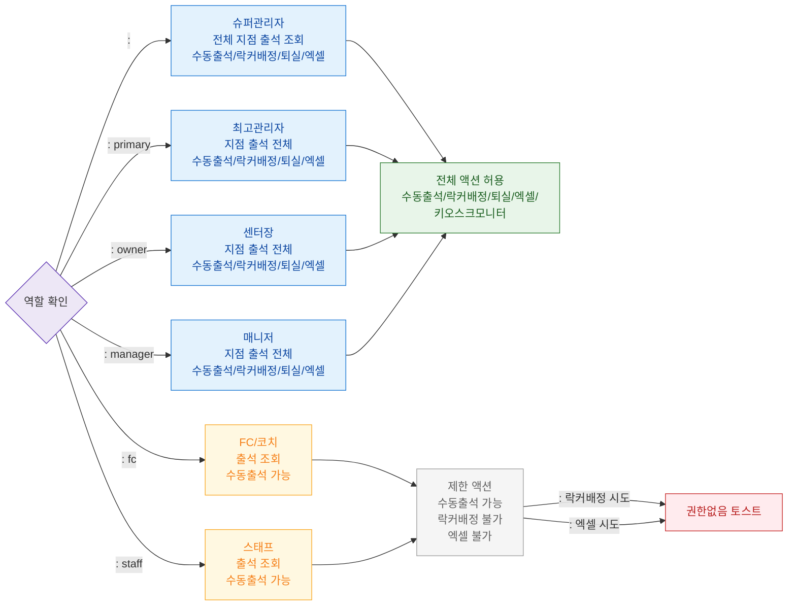

# F7 권한(RBAC) 분기 플로우 — SCR-I001 통합 출석 관리

## 목적
6개 역할별 접근 및 액션 가능 범위를 정의한다.

## 다이어그램

## TC 후보

| TC ID | 타입 | Given | When | Then | |-------|------|-------|------|------| | TC-I001-F7-01 | positive | manager | 출석 관리 진입 | 전체 액션 버튼 표시 | | TC-I001-F7-02 | positive | staff | 출석 관리 진입 | 수동 출석 버튼만 활성 | | TC-I001-F7-03 | negative | fc | 락커 배정 버튼 클릭 | 권한없음 토스트 | | TC-I001-F7-04 | negative | staff | 엑셀 다운로드 버튼 클릭 | 권한없음 토스트 |
