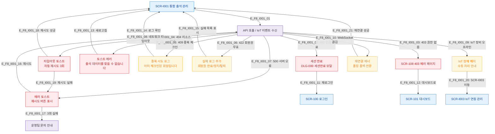

# F8 에러/예외/복구 플로우 — SCR-I001 통합 출석 관리

## 목적
에러코드별 분기, 재시도/로그아웃/리다이렉트 복구 경로를 정의한다.

## 다이어그램

## TC 후보

| TC ID | 타입 | Given | When | Then |
|-------|------|-------|------|------|
| TC-I001-F8-01 | negative | manager | 세션 만료 상태에서 API 호출 | 세션 만료 모달 표시 |
| TC-I001-F8-02 | negative | manager | 서버 500 오류 | 에러 토스트 + 재시도 버튼 |
| TC-I001-F8-03 | negative | manager | 만료 회원 체크인 | 422 실패 로그 추가, 실패 사유 표시 |
| TC-I001-F8-04 | negative | manager | 동일 회원 중복 체크인 | 409 중복 로그 추가 |
| TC-I001-F8-05 | negative | manager | IoT 장비 오프라인 | 장애 배지 표시, 수동 처리 안내 |
| TC-I001-F8-06 | negative | manager | 네트워크 타임아웃 | 자동 재시도 3회 후 에러 토스트 |
