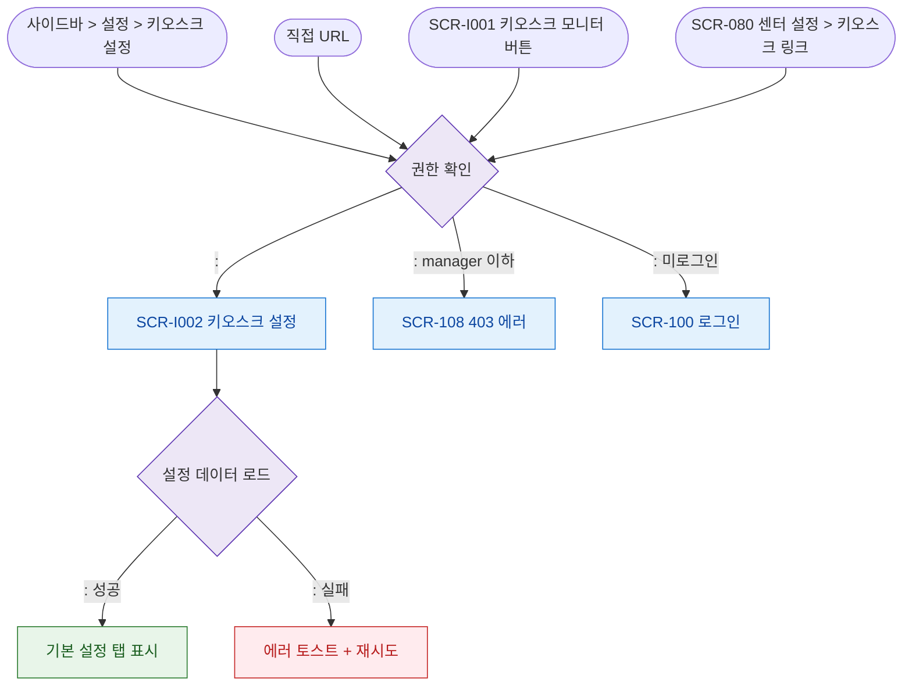

# F1 진입 플로우 — SCR-I002 키오스크 설정

## 목적
키오스크 설정 화면(``)으로 진입 가능한 모든 경로를 정의한다.

## 전제조건
- 로그인 세션 유효
- 설정 > 키오스크 설정 접근 권한 (만 가능)

## 다이어그램

## TC 후보
| TC ID | 타입 | Given | When | Then | |-------|------|-------|------|------| | TC-I002-F1-01 | positive | owner | 사이드바 > 설정 > 키오스크 설정 | 키오스크 설정 화면 진입 | | TC-I002-F1-02 | negative | manager | 직접 접근 | 403 에러 페이지 | | TC-I002-F1-03 | positive | primary | SCR-I001 키오스크 모니터 버튼 | 키오스크 설정 화면 진입 |
