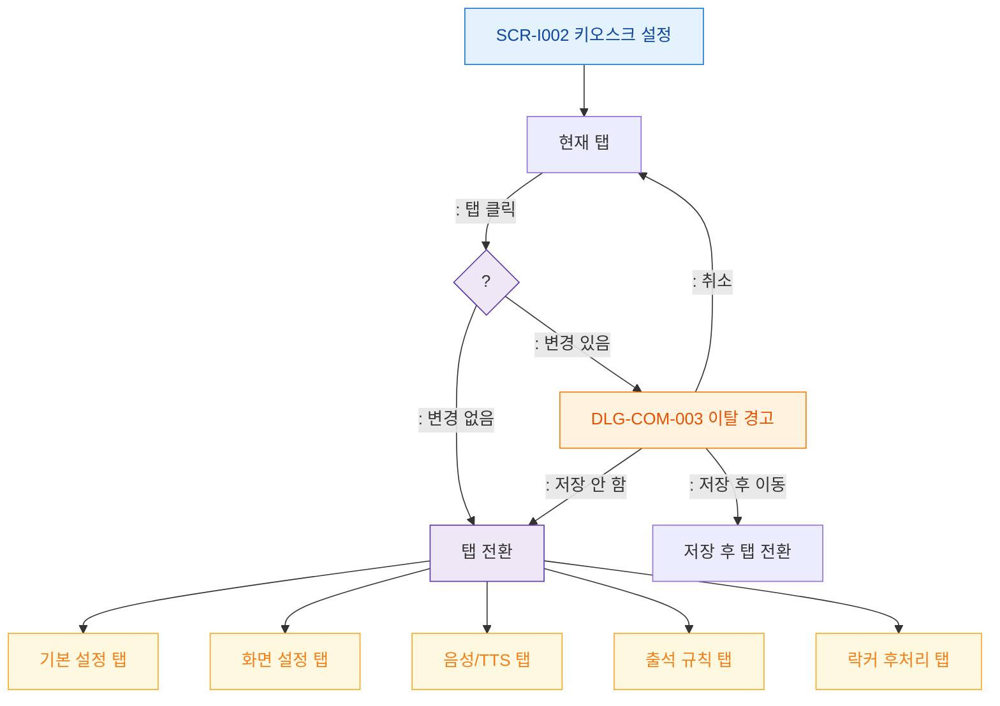

# F4 탭 전환 플로우 — SCR-I002 키오스크 설정

## 목적
설정 화면의 5개 탭 전환 및 미저장 경고 처리를 정의한다.

## 다이어그램

## TC 후보
| TC ID | 타입 | Given | When | Then | |-------|------|-------|------|------| | TC-I002-F4-01 | positive | owner, 변경 없음 | 탭 클릭 | 즉시 탭 전환 | | TC-I002-F4-02 | positive | owner, 변경 있음 | 탭 클릭 | DLG-COM-003 이탈 경고 표시 | | TC-I002-F4-03 | positive | owner | DLG-COM-003 > 저장 후 이동 | 저장 후 탭 전환 |
