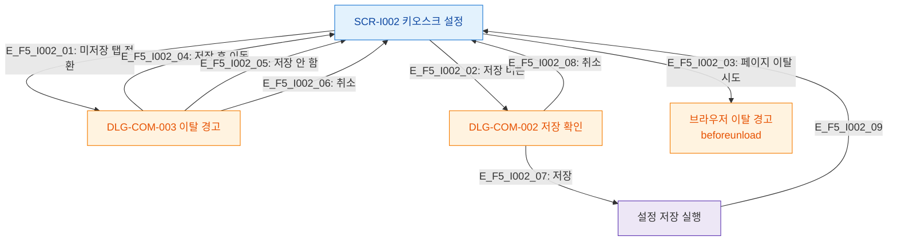

# F5 모달 트리거 트리 — SCR-I002 키오스크 설정

## 다이어그램

## TC 후보
| TC ID | 타입 | Given | When | Then |
|-------|------|-------|------|------|
| TC-I002-F5-01 | positive | owner, isDirty=true | 탭 전환 | DLG-COM-003 표시 |
| TC-I002-F5-02 | positive | owner | 저장 버튼 클릭 | DLG-COM-002 표시 |
