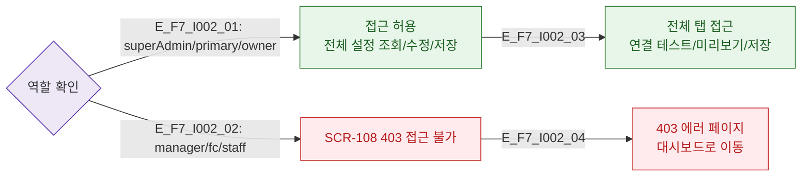

# F7 권한(RBAC) 분기 플로우 — SCR-I002 키오스크 설정

## 다이어그램

## TC 후보
| TC ID | 타입 | Given | When | Then |
|-------|------|-------|------|------|
| TC-I002-F7-01 | positive | owner | 키오스크 설정 진입 | 전체 설정 탭 접근 가능 |
| TC-I002-F7-02 | negative | manager | /settings/kiosk 접근 | 403 에러 페이지 |
