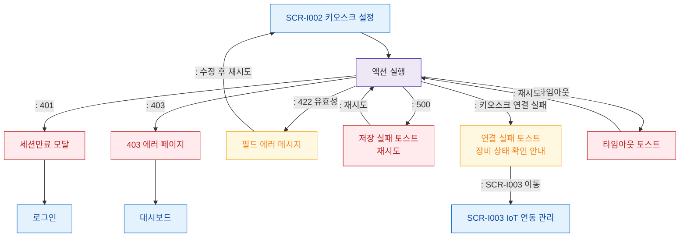

# F8 에러/예외/복구 플로우 — SCR-I002 키오스크 설정

## 다이어그램

## TC 후보
| TC ID | 타입 | Given | When | Then | |-------|------|-------|------|------| | TC-I002-F8-01 | negative | owner | 저장 시 서버 500 | 저장 실패 토스트 | | TC-I002-F8-02 | negative | owner | 필수 필드 누락 저장 | 필드 에러 메시지 | | TC-I002-F8-03 | negative | owner | 키오스크 연결 테스트 실패 | 연결 실패 토스트 + SCR-I003 안내 |
