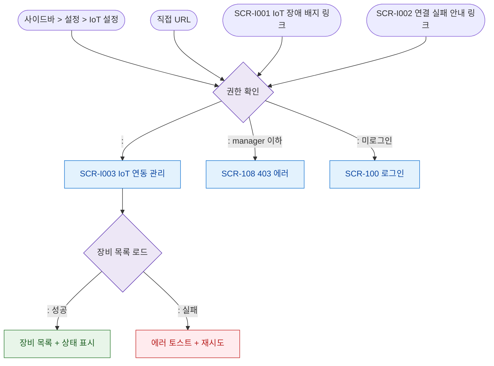

# F1 진입 플로우 — SCR-I003 IoT 연동 관리

## 목적
IoT 연동 관리 화면(``)으로 진입 가능한 모든 경로를 정의한다.

## 전제조건
- 로그인 세션 유효
- IoT/출입 관리 접근 권한 (만 가능)

## 다이어그램

## TC 후보
| TC ID | 타입 | Given | When | Then | |-------|------|-------|------|------| | TC-I003-F1-01 | positive | owner | 사이드바 > 설정 > IoT 설정 | IoT 연동 관리 진입 | | TC-I003-F1-02 | negative | manager | 직접 접근 | 403 에러 | | TC-I003-F1-03 | positive | owner | SCR-I001 IoT 장애 배지 클릭 | IoT 연동 관리 진입 |
